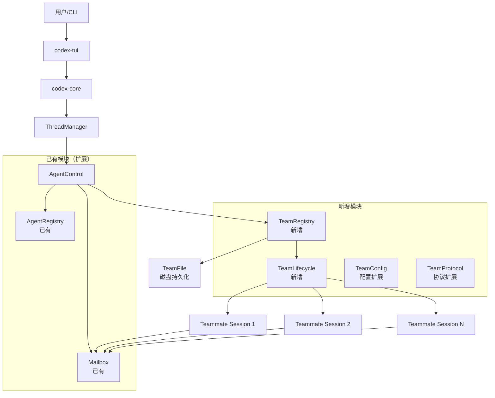
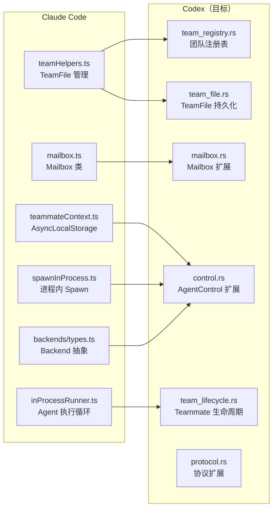
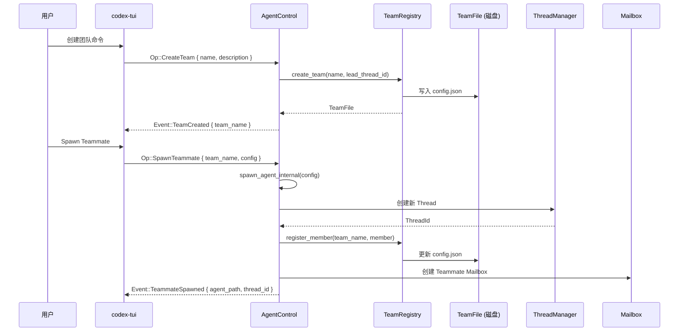
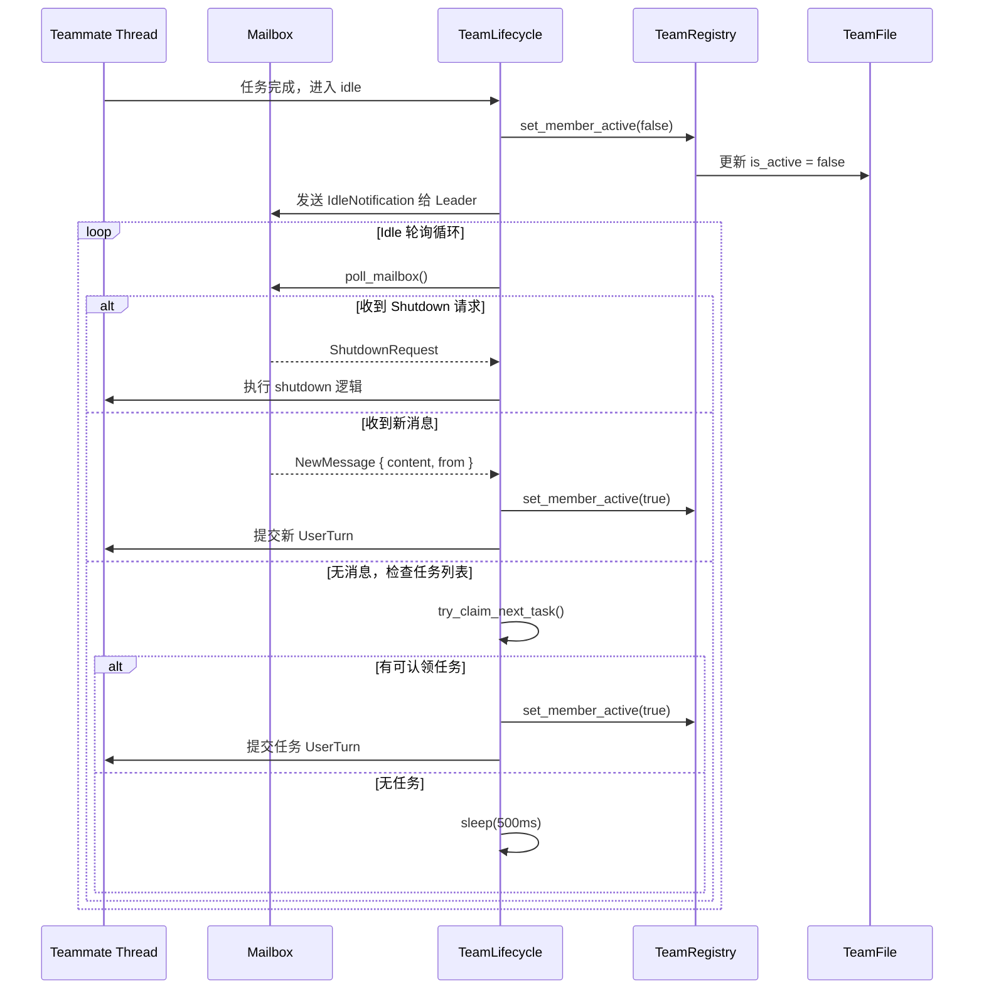
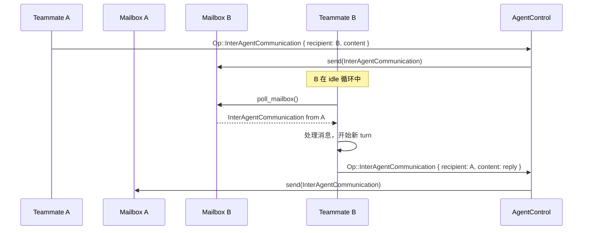

# 设计文档: Team Agent Mode — 将 Claude Code 的团队 Agent 模式迁移到 Codex

## 概述

本设计将 Claude Code 的 Team Agent（Swarm）模式核心能力迁移到 Codex CLI 中，扩展 Codex 现有的多 Agent 运行模型参数支持。Claude Code 的 Team Agent 模式允许一个 Team Lead（团队领导者）动态创建和管理多个 Teammate（团队成员），每个 Teammate 拥有独立身份、独立上下文、独立模型配置，并通过 Mailbox（邮箱）机制实现 Agent 间通信。Teammate 可以在同一进程内（In-Process）运行，也可以通过终端面板（Tmux/iTerm2）运行。

Codex 已有基于 `AgentControl` + `AgentRegistry` + `Mailbox` 的多 Agent 基础设施（ThreadSpawn 模式），但缺少以下 Team Agent 核心能力：
1. **团队生命周期管理**：创建团队、注册成员、团队配置文件持久化
2. **Teammate 身份与角色系统**：每个 Teammate 有独立的 name/color/model/role/permissionMode
3. **Idle 循环与任务认领**：Teammate 完成任务后进入 idle 状态，自动从任务列表认领新任务
4. **权限同步与 Plan Mode**：Teammate 可独立切换权限模式，支持 Plan Mode 审批流程
5. **团队配置扩展**：在 Codex 的 Config 层面支持 team agent 相关参数

本设计在 Codex 现有 Rust 架构上扩展，不引入 Node.js 依赖，保持 Codex 的 Rust-native 特性。

## 架构

### 系统总览



### 与 Claude Code 架构的映射关系



## 组件和接口

### 组件 1: TeamRegistry（新增 crate: `codex-team`）

**用途**: 管理团队的创建、成员注册、配置持久化，对应 Claude Code 的 `teamHelpers.ts`。

**职责**:
- 创建/删除团队
- 注册/移除团队成员
- 读写 TeamFile（JSON 配置文件）
- 跟踪成员活跃状态
- 会话级团队清理

### 组件 2: TeamLifecycle（新增模块，位于 `codex-team`）

**用途**: 管理 Teammate 的完整生命周期，对应 Claude Code 的 `inProcessRunner.ts`。

**职责**:
- Teammate 的 spawn/idle/resume/shutdown 状态机
- Idle 循环中的邮箱轮询和任务认领
- 权限同步与 Plan Mode 审批
- Shutdown 请求处理

### 组件 3: 协议扩展（`codex-protocol`）

**用途**: 扩展 Op/Event 枚举以支持团队操作。

### 组件 4: 配置扩展（`codex-config`）

**用途**: 在 config.toml 中支持团队相关配置参数。

## 数据模型

### TeamFile（团队配置文件）

```rust
/// 团队配置文件，持久化到 ~/.codex/teams/{team-name}/config.json
/// 对应 Claude Code 的 TeamFile 类型
#[derive(Debug, Clone, Serialize, Deserialize)]
pub struct TeamFile {
    /// 团队名称
    pub name: String,
    /// 团队描述
    pub description: Option<String>,
    /// 创建时间戳（Unix 秒）
    pub created_at: i64,
    /// Team Lead 的 AgentPath
    pub lead_agent_path: AgentPath,
    /// Team Lead 的 ThreadId
    pub lead_thread_id: ThreadId,
    /// 团队成员列表
    pub members: Vec<TeamMember>,
}

/// 团队成员信息
/// 对应 Claude Code TeamFile.members 中的元素
#[derive(Debug, Clone, Serialize, Deserialize)]
pub struct TeamMember {
    /// 成员的 AgentPath（如 /root/researcher）
    pub agent_path: AgentPath,
    /// 显示名称（如 "researcher"）
    pub name: String,
    /// 角色类型（如 "researcher", "test-runner"）
    pub agent_role: Option<String>,
    /// 模型覆盖（如 "o3-mini"）
    pub model: Option<String>,
    /// 初始提示词
    pub prompt: Option<String>,
    /// UI 颜色标识
    pub color: Option<String>,
    /// 是否要求 Plan Mode
    pub plan_mode_required: bool,
    /// 加入时间戳
    pub joined_at: i64,
    /// 对应的 ThreadId
    pub thread_id: ThreadId,
    /// 工作目录
    pub cwd: PathBuf,
    /// 当前权限模式
    pub permission_mode: Option<PermissionMode>,
    /// 是否活跃（false = idle）
    pub is_active: bool,
}
```

### TeammateIdentity（运行时身份）

```rust
/// Teammate 的运行时身份信息
/// 对应 Claude Code 的 TeammateIdentity / TeammateContext
#[derive(Debug, Clone)]
pub struct TeammateIdentity {
    /// 完整 Agent 路径（如 /root/researcher）
    pub agent_path: AgentPath,
    /// 显示名称
    pub agent_name: String,
    /// 所属团队名称
    pub team_name: String,
    /// UI 颜色
    pub color: Option<String>,
    /// 是否要求 Plan Mode
    pub plan_mode_required: bool,
    /// Leader 的 ThreadId（用于关联追踪）
    pub parent_thread_id: ThreadId,
}
```

### TeammateStatus（状态机）

```rust
/// Teammate 的生命周期状态
/// 对应 Claude Code 中 InProcessTeammateTaskState 的 status + isIdle 组合
#[derive(Debug, Clone, PartialEq, Eq)]
pub enum TeammateStatus {
    /// 正在处理任务
    Active,
    /// 空闲，等待新任务或消息
    Idle,
    /// 等待 Plan Mode 审批
    AwaitingPlanApproval,
    /// 正在关闭
    ShuttingDown,
    /// 已终止
    Terminated,
}
```

### PermissionMode（权限模式）

```rust
/// Teammate 的权限模式
/// 对应 Claude Code 的 PermissionMode
#[derive(Debug, Clone, Copy, PartialEq, Eq, Serialize, Deserialize)]
pub enum PermissionMode {
    /// 默认模式：按正常审批流程
    Default,
    /// Plan 模式：只能规划，不能执行
    Plan,
    /// Auto 模式：自动审批
    Auto,
}
```

## 主要工作流

### 团队创建与 Teammate Spawn 流程



### Teammate Idle 循环与任务认领



### Agent 间通信流程



## Key Functions with Formal Specifications

### Function 1: create_team()

```rust
/// 创建一个新团队并持久化配置文件
pub async fn create_team(
    &self,
    team_name: &str,
    description: Option<&str>,
    lead_thread_id: ThreadId,
    lead_agent_path: AgentPath,
) -> CodexResult<TeamFile>
```

**前置条件:**
- `team_name` 非空且仅包含字母数字和连字符
- `lead_thread_id` 对应一个有效的活跃 Thread
- 同名团队不存在

**后置条件:**
- `~/.codex/teams/{sanitized_name}/config.json` 已创建
- 返回的 `TeamFile` 包含 lead 信息且 members 为空
- 团队已注册到会话清理列表

**循环不变量:** N/A

### Function 2: spawn_teammate()

```rust
/// 在团队中 spawn 一个新的 Teammate
/// 扩展现有 AgentControl::spawn_agent_internal
pub async fn spawn_teammate(
    &self,
    team_name: &str,
    config: TeammateSpawnConfig,
) -> CodexResult<TeammateSpawnResult>
```

**前置条件:**
- 团队 `team_name` 已存在
- `config.name` 在团队中唯一
- 当前活跃 Teammate 数量 < `agent_max_threads`

**后置条件:**
- 新 Thread 已创建并提交初始 prompt
- TeamFile 中已添加新成员记录
- Mailbox 已为新 Teammate 创建
- 返回包含 `thread_id` 和 `agent_path` 的结果

### Function 3: teammate_idle_loop()

```rust
/// Teammate 的 idle 循环：轮询邮箱和任务列表
/// 对应 Claude Code 的 waitForNextPromptOrShutdown
async fn teammate_idle_loop(
    &self,
    identity: &TeammateIdentity,
    mailbox_rx: &mut MailboxReceiver,
    cancel: CancellationToken,
) -> TeammateIdleResult
```

**前置条件:**
- Teammate 当前处于 `TeammateStatus::Idle` 状态
- `mailbox_rx` 是该 Teammate 的邮箱接收端
- `cancel` 未被取消

**后置条件:**
- 返回 `ShutdownRequest` | `NewMessage` | `Cancelled`
- 如果返回 `NewMessage`，消息已从邮箱中消费
- 如果返回 `ShutdownRequest`，shutdown 请求已被确认

**循环不变量:**
- 每次迭代中，已处理的消息不会被重复处理
- 轮询间隔保持 500ms

### Function 4: send_inter_agent_communication() (扩展)

```rust
/// 发送 Agent 间通信消息
/// 扩展现有方法以支持团队内广播
pub async fn send_inter_agent_communication(
    &self,
    communication: InterAgentCommunication,
) -> CodexResult<()>
```

**前置条件:**
- `communication.author` 是有效的 AgentPath
- `communication.recipient` 是有效的 AgentPath 或团队广播地址

**后置条件:**
- 消息已投递到所有目标 Teammate 的 Mailbox
- 如果 `trigger_turn` 为 true，目标 Teammate 将被唤醒

## 算法伪代码

### Teammate 生命周期状态机

```pascal
ALGORITHM TeammateLifecycle(identity, initial_prompt, config)
INPUT: identity: TeammateIdentity, initial_prompt: String, config: TeammateSpawnConfig
OUTPUT: TeammateResult

BEGIN
  state ← Active
  current_prompt ← initial_prompt
  
  LOOP
    ASSERT state IN {Active, Idle, AwaitingPlanApproval}
    
    CASE state OF
      Active:
        // 执行 Agent turn
        IF config.plan_mode_required AND NOT plan_approved THEN
          state ← AwaitingPlanApproval
          CONTINUE
        END IF
        
        result ← execute_agent_turn(current_prompt, identity)
        
        IF result.is_complete THEN
          // 通知 Leader 进入 idle
          send_idle_notification(identity)
          set_member_active(identity.team_name, identity.agent_name, false)
          state ← Idle
        END IF
        
      Idle:
        // 轮询邮箱和任务列表
        wait_result ← teammate_idle_loop(identity, mailbox_rx, cancel)
        
        CASE wait_result OF
          ShutdownRequest(reason):
            state ← ShuttingDown
            EXIT LOOP
          NewMessage(content, from):
            current_prompt ← format_as_teammate_message(from, content)
            set_member_active(identity.team_name, identity.agent_name, true)
            state ← Active
          Cancelled:
            EXIT LOOP
        END CASE
        
      AwaitingPlanApproval:
        approval ← wait_for_plan_approval(identity)
        IF approval.approved THEN
          plan_approved ← true
          state ← Active
        ELSE
          state ← Idle
        END IF
    END CASE
  END LOOP
  
  // 清理
  remove_member_from_team(identity.team_name, identity.agent_path)
  RETURN TeammateResult { success: true }
END
```

### 邮箱轮询算法

```pascal
ALGORITHM TeammateIdleLoop(identity, mailbox_rx, cancel)
INPUT: identity: TeammateIdentity, mailbox_rx: MailboxReceiver, cancel: CancellationToken
OUTPUT: TeammateIdleResult

BEGIN
  CONST POLL_INTERVAL_MS ← 500
  
  LOOP
    IF cancel.is_cancelled() THEN
      RETURN Cancelled
    END IF
    
    // 1. 检查 Mailbox 中的消息
    IF mailbox_rx.has_pending() THEN
      messages ← mailbox_rx.drain()
      
      // 优先处理 shutdown 请求
      FOR each msg IN messages DO
        IF is_shutdown_request(msg) THEN
          RETURN ShutdownRequest(msg)
        END IF
      END FOR
      
      // 优先处理来自 Leader 的消息
      FOR each msg IN messages DO
        IF msg.author = leader_path THEN
          RETURN NewMessage(msg.content, msg.author)
        END IF
      END FOR
      
      // 处理其他消息（FIFO）
      IF messages IS NOT EMPTY THEN
        RETURN NewMessage(messages[0].content, messages[0].author)
      END IF
    END IF
    
    // 2. 检查任务列表
    task ← try_claim_next_task(identity.team_name, identity.agent_name)
    IF task IS NOT NULL THEN
      RETURN NewMessage(format_task_as_prompt(task), "task-list")
    END IF
    
    // 3. 等待下一次轮询
    sleep(POLL_INTERVAL_MS)
  END LOOP
END
```

## 示例用法

```rust
// 示例 1: 创建团队
let team = agent_control.create_team(
    "my-research-team",
    Some("Research and testing team"),
    lead_thread_id,
    AgentPath::root(),
).await?;

// 示例 2: Spawn Teammate
let teammate = agent_control.spawn_teammate(
    "my-research-team",
    TeammateSpawnConfig {
        name: "researcher".to_string(),
        agent_role: Some("researcher".to_string()),
        model: Some("o3-mini".to_string()),
        prompt: "Research the codebase and find all security issues".to_string(),
        color: Some("blue".to_string()),
        plan_mode_required: false,
        cwd: PathBuf::from("/workspace"),
        permission_mode: PermissionMode::Default,
    },
).await?;

// 示例 3: 发送消息给 Teammate
agent_control.send_inter_agent_communication(
    InterAgentCommunication::new(
        AgentPath::root(),                              // from: leader
        teammate.agent_path.clone(),                    // to: researcher
        Vec::new(),                                     // no other recipients
        "Please also check for SQL injection".to_string(),
        true,                                           // trigger_turn
    ),
).await?;

// 示例 4: 通过 Op 提交团队操作
let op = Op::CreateTeam {
    name: "my-team".to_string(),
    description: Some("A team for parallel work".to_string()),
};
session.submit(op).await?;

let op = Op::SpawnTeammate {
    team_name: "my-team".to_string(),
    config: TeammateSpawnConfig { /* ... */ },
};
session.submit(op).await?;

// 示例 5: config.toml 中的团队配置
// [team]
// max_teammates = 8
// default_permission_mode = "default"
// idle_poll_interval_ms = 500
// plan_mode_required = false
// 
// [[team.roles]]
// name = "researcher"
// model = "o3-mini"
// system_prompt = "You are a research specialist..."
// plan_mode_required = true
```

## 正确性属性

1. **团队成员唯一性**: ∀ team, ∀ member_a, member_b ∈ team.members: member_a.name ≠ member_b.name ∧ member_a.agent_path ≠ member_b.agent_path
2. **状态一致性**: ∀ teammate: teammate.status = Idle ⟹ teammate.is_active = false ∧ idle_notification_sent
3. **消息不丢失**: ∀ msg sent to mailbox: msg 最终被 drain() 消费 ∨ teammate 被终止
4. **Shutdown 优先级**: ∀ shutdown_request ∈ mailbox: shutdown_request 优先于普通消息被处理
5. **清理保证**: ∀ team created in session: session 结束时 team 目录被清理（除非显式保留）
6. **线程数限制**: ∀ team: |active_teammates| ≤ config.agent_max_threads

## 错误处理

### 错误场景 1: Teammate Spawn 失败

**条件**: 达到最大线程数限制或配置无效
**响应**: 返回 `CodexErr::MaxAgentsReached` 或 `CodexErr::InvalidTeammateConfig`
**恢复**: 不创建 Thread，不修改 TeamFile，向用户报告错误

### 错误场景 2: TeamFile 读写失败

**条件**: 磁盘 I/O 错误或文件损坏
**响应**: 日志记录错误，返回 `None` 或 `Err`
**恢复**: 内存中的 TeamRegistry 状态仍然有效，下次写入时重试

### 错误场景 3: Teammate 异常终止

**条件**: Agent turn 执行中 panic 或 abort
**响应**: 捕获错误，更新 TeamFile 中成员状态为 terminated
**恢复**: 从 TeamFile 中移除成员，释放 Mailbox 资源，通知 Leader

### 错误场景 4: Leader 异常退出

**条件**: Leader 进程崩溃或被 kill
**响应**: 会话清理钩子触发 `cleanup_session_teams()`
**恢复**: 清理所有该会话创建的团队目录和 Teammate Thread

## 测试策略

### 单元测试

- TeamFile 的序列化/反序列化
- TeamRegistry 的成员注册/移除/查找
- TeammateStatus 状态机转换
- Mailbox 消息优先级排序（shutdown > leader > peer）
- PermissionMode 切换逻辑
- sanitize_name / format_agent_id 工具函数

### Property-Based Testing

**Property Test Library**: proptest (Rust)

- 属性: 任意数量的并发 spawn/kill 操作后，TeamFile.members 与 AgentRegistry 保持一致
- 属性: 任意消息序列发送到 Mailbox 后，drain() 返回的消息顺序与发送顺序一致
- 属性: 任意 team_name 经过 sanitize_name 后仅包含 `[a-z0-9-]`

### 集成测试

- 完整的团队创建 → spawn teammate → 执行任务 → idle → 认领新任务 → shutdown 流程
- 多 Teammate 并发执行与通信
- Leader 异常退出后的清理验证
- config.toml 中团队配置的加载与生效

## 性能考虑

- **Mailbox 轮询**: 使用 `tokio::sync::watch` 的通知机制避免忙等待，500ms 轮询间隔仅作为 fallback
- **TeamFile I/O**: 使用异步文件操作，避免阻塞 tokio runtime
- **内存**: 每个 Teammate 的消息历史有上限（参考 Claude Code 的 `TEAMMATE_MESSAGES_UI_CAP = 50`）
- **线程数**: 通过 `agent_max_threads` 配置限制并发 Teammate 数量，默认 8

## 安全考虑

- Teammate 继承 Leader 的沙箱策略，不能突破 Leader 的权限边界
- Plan Mode 要求 Teammate 在执行前获得 Leader 审批
- 团队配置文件存储在用户 home 目录下，遵循现有 Codex 的文件权限模型
- Agent 间通信内容不包含敏感凭证，仅传递任务描述和结果摘要

## 依赖

- `codex-protocol`: 扩展 Op/Event 枚举（新增 CreateTeam, SpawnTeammate, ShutdownTeammate 等）
- `codex-core`: 扩展 AgentControl 和 Session 以支持团队操作
- `codex-config`: 扩展 config.toml schema 以支持 `[team]` 配置段
- `codex-state`: 扩展状态数据库以持久化团队元数据
- `serde` / `serde_json`: TeamFile 序列化
- `tokio`: 异步运行时（已有依赖）
